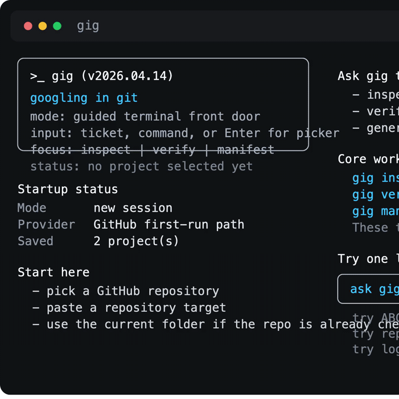

# gig



`gig` is a remote-first release audit CLI for one critical question:

`Did we miss any change for this ticket?`

The product story is simple:

`gig = googling in git`

That question gets expensive when:

- one ticket touches backend, frontend, database, scripts, or low-code assets
- QA or client review adds late follow-up fixes
- release teams have to reopen multiple repos just to decide whether the next move is safe

`gig` turns that into one deterministic workflow:

- `inspect` collects the full ticket story across repositories and branches
- `verify` returns a `safe`, `warning`, or `blocked` verdict
- `manifest` exports a release packet in Markdown or JSON
- `gig` opens a guided terminal front door so first-time users can pick a repo with ↑/↓ and Enter instead of memorizing flags

Why teams adopt it:

- remote-first: works directly against GitHub, GitLab, Bitbucket, Azure DevOps, and remote SVN
- zero-config-first: start with `--repo`, add `gig.yaml` only when inference needs help
- auditable by default: repository evidence first, optional AI explanation second

## Install

Use the direct installer until the first npm bootstrap publish is live:

```bash
curl -fsSL https://raw.githubusercontent.com/phamhungptithcm/gig/main/scripts/install.sh | sh
gig version
```

If `@hunpeolabs/gig` is already available in your environment, this also works:

```bash
npm install -g @hunpeolabs/gig
gig version
```

If npm returns `404`, the first package publish has not completed yet.

## Fastest Path

```bash
gig
gig login github
gig ABC-123 --repo github:owner/name
gig verify ABC-123 --repo github:owner/name
gig manifest ABC-123 --repo github:owner/name
```

If you are brand new, start with `gig` first and use `↑/↓` then `Enter` to pick a GitHub repo, a saved project, or the current folder.
If you already know the repo target, jump straight to `inspect`.
You can also type straight into the front door, for example: `ABC-123`, `inspect ABC-123`, `verify ABC-123`, `manifest ABC-123`, or `repo github:owner/name ABC-123`.

Remote target forms:

- `github:owner/name`
- `gitlab:group/project`
- `bitbucket:workspace/repo`
- `azure-devops:org/project/repo`
- `svn:https://svn.example.com/repos/app/branches/staging/ProductName`

Local fallback is still available:

```bash
gig ABC-123 --path .
gig verify ABC-123 --path .
```

## Demo And Docs

- [Quick Start](docs/19-quickstart.md)
- [Demo Guide](docs/25-demo-guide.md)
- [Portfolio Guide](docs/26-portfolio-guide.md)
- [Docs site](https://phamhungptithcm.github.io/gig/)

## Scope

`gig` is strongest at ticket reconciliation, release verification, and release packet generation.
It does not try to replace code review, CI/CD, or human release approval.

The AI layer is optional.
`gig` remains the source of truth.
