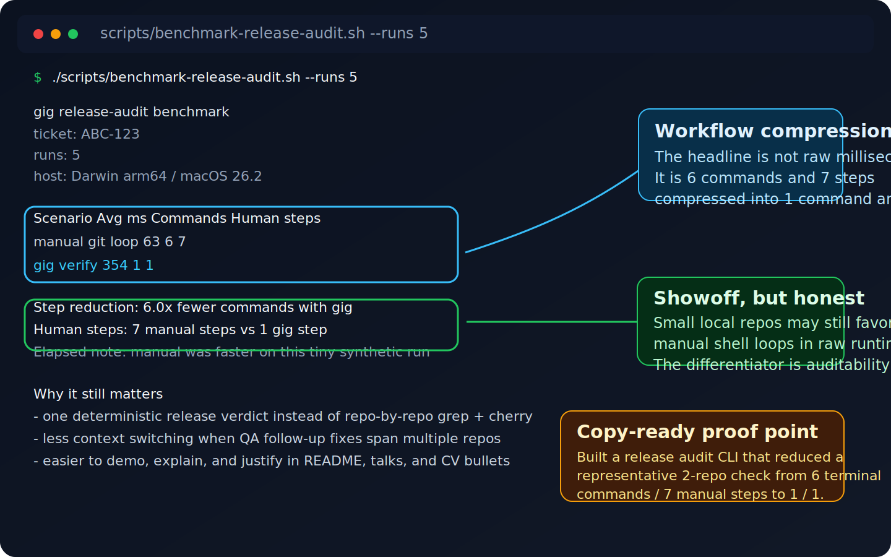

# gig


`gig` is a remote-first release audit CLI for one critical question:

`Did we miss any change for this ticket?`

The product story is simple:

`gig = ticket-to-release confidence`

That question gets expensive when:

- one ticket touches backend, frontend, database, scripts, or low-code assets
- QA or client review adds late follow-up fixes
- release teams have to reopen multiple repos just to decide whether the next move is safe

`gig` turns that into one deterministic workflow:

- `inspect` collects the full ticket story across repositories and branches
- `verify` returns a `safe`, `warning`, or `blocked` verdict
- `packet` exports a release packet in Markdown or JSON
- `gig` opens a guided terminal front door that detects the current Git/SVN checkout before asking for a remote provider

Why teams adopt it:

- remote-first: works directly against GitHub, GitLab, Bitbucket, Azure DevOps, and remote SVN
- zero-config-first: from inside a Git checkout, start without `--repo`; add `gig.yaml` only when inference needs help
- auditable by default: repository evidence first, optional AI explanation second

## Install

The direct installer is the canonical install path:

```bash
curl -fsSL https://raw.githubusercontent.com/phamhungptithcm/gig/main/scripts/install.sh | sh
gig version
```

Pin a specific release when you need a reproducible rollout:

```bash
curl -fsSL https://raw.githubusercontent.com/phamhungptithcm/gig/main/scripts/install.sh | sh -s -- --version v2026.04.17
gig version
```

Refresh later with:

```bash
gig update
```

If your team already distributes CLIs through npm and `@hunpeolabs/gig` is available in that environment, npm remains a compatibility channel. The direct installer stays the default product path.

Use npm in one of these two ways:

```bash
npm install -g @hunpeolabs/gig
gig --help
```

or without a global install:

```bash
npx @hunpeolabs/gig --help
```

`npm install @hunpeolabs/gig` adds `gig` to the current project only.
Run it with `npx gig` from that project, or install it globally with `npm install -g`.

## Fastest Path

```bash
gig
gig setup --provider github
gig login
gig ABC-123
gig verify ABC-123
gig packet ABC-123
```

If you are brand new, start with `gig` first. It detects the current Git/SVN checkout when you are already inside one, otherwise use `↑/↓` then `Enter` to pick a remote repo, a saved project, or the current folder.
If you type `gig login` without a provider, `gig` now asks which provider you want to use.
If you are not inside a checkout, pass a repo target once or save a project.
You can also type straight into the front door, for example: `ABC-123`, `inspect ABC-123`, `verify ABC-123`, `packet ABC-123`, or `repo github:owner/name ABC-123`.
Read-only remote commands do not start interactive login; they print the exact `gig login <provider>` command when auth or a provider CLI is missing.
Use `gig setup --provider <name>` to check required local tools first. Add `--install-missing` only when you want `gig` to ask before running install commands.

Remote targets are optional when the current Git `origin` points at a supported provider.
They remain useful for CI, scripts, and audits from outside the checkout.

Remote target forms:

- `github:owner/name`
- `gitlab:group/project`
- `bitbucket:workspace/repo`
- `azure-devops:org/project/repo`
- `svn:https://svn.example.com/repos/app/branches/staging/ProductName`

Provider coverage today:

| Provider | Coverage |
| --- | --- |
| GitHub | deep release evidence: PRs, deployments, checks, linked issues, releases |
| GitLab | deep release evidence: merge requests, deployments, checks, linked issues, releases |
| Bitbucket | basic release evidence: pull requests, deployments, branching model |
| Azure DevOps | deep release evidence: pull requests, deployments, checks, linked work items |
| Remote SVN | audit topology only: branch and trunk discovery |

Local fallback is still available:

```bash
gig ABC-123 --path .
gig verify ABC-123 --path . --from staging --to main
gig project add local --path . --from staging --to main --use
```

If protected branches are ambiguous, `gig` stops and says it is not sure instead of guessing a promotion path.
In an interactive terminal, it can ask for the source and target branch. In scripts, pass explicit `--from` and `--to`, or save them in a project. Add `--envs` only when the environment order itself needs an override.

## Demo And Docs

- [Quick Start](docs/19-quickstart.md)
- [Demo Guide](docs/25-demo-guide.md)
- [Portfolio Guide](docs/26-portfolio-guide.md)
- [Docs site](https://phamhungptithcm.github.io/gig/)

## Scope

`gig` is strongest at ticket reconciliation, release verification, and release packet generation.
It does not try to replace code review, CI/CD, or human release approval.

The AI layer is optional.
`gig` remains the source of truth.

For release-day support and CI diagnostics, set:

```bash
export GIG_DIAGNOSTICS_FILE=/tmp/gig-diagnostics.jsonl
```

That file captures structured auth and topology events so teams can trace provider access and promotion inference without turning normal terminal output into log noise.

When the DeerFlow sidecar is enabled, `gig` can keep the last AI brief alive:

```bash
gig explain ABC-123
gig resume
gig ask "what is still blocked?"
gig ask "what changed since the last brief?"
```

`gig` resumes the last DeerFlow thread for the current project or remembered repo target, so returning to the same project brings the right brief back instead of one global AI state.

## Benchmark

To compare manual repo-by-repo audit work against one `gig` command on the same synthetic workspace:

```bash
./scripts/benchmark-release-audit.sh --runs 5
```

The script prints average elapsed time, command count, and the step reduction between a manual git loop and `gig verify`.



Sample run on April 17, 2026 on `Darwin arm64` / macOS `26.2`:

| Scenario | Avg ms | Commands | Human steps |
| --- | ---: | ---: | ---: |
| manual git loop | 63 | 6 | 7 |
| `gig verify` | 354 | 1 | 1 |

What this shows:

- `gig` compressed the operator workflow from `6` terminal commands and `7` manual steps to `1` command and `1` step on the same 2-repo release audit.
- The tiny local synthetic workspace still favored the manual loop in raw elapsed time, so the honest claim is workflow compression, deterministic verdicts, and less repo-by-repo review churn, not faster `grep`.
- On real release-day usage, the gap is usually larger because humans also have to read, reconcile, and explain the result, not just run shell commands.

Resume-friendly proof point:

> Built a remote-first release audit CLI that reduced a representative 2-repo release check from 6 terminal commands / 7 manual steps to 1 command / 1 step while producing a deterministic release verdict.
