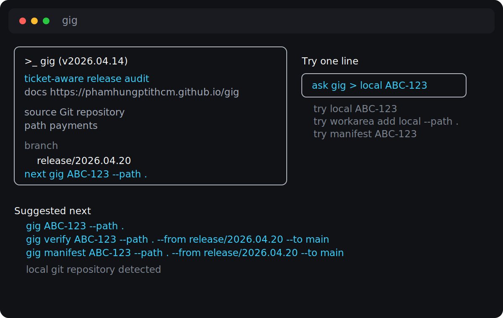
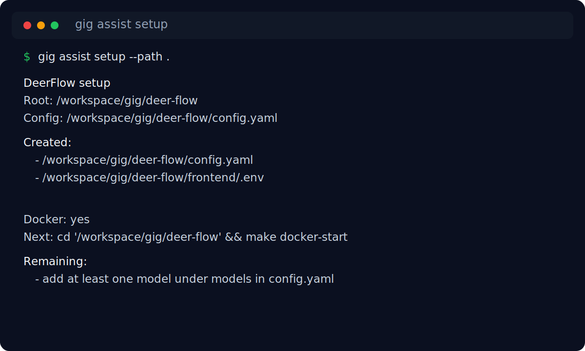
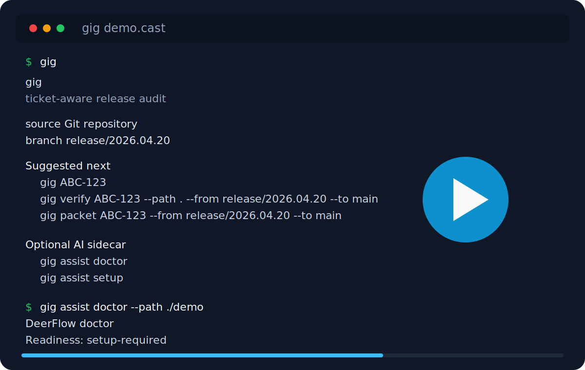
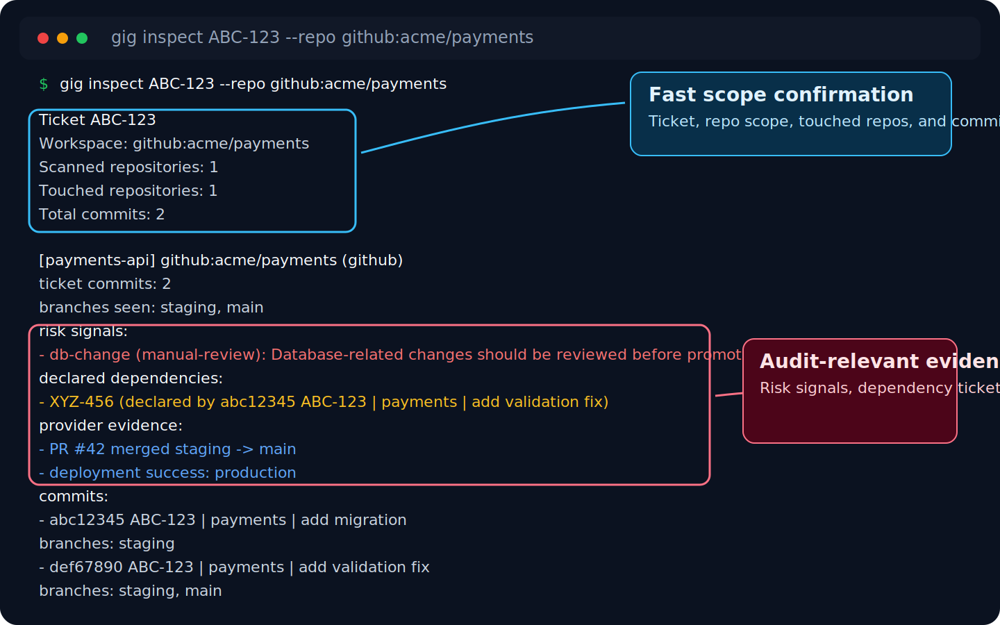
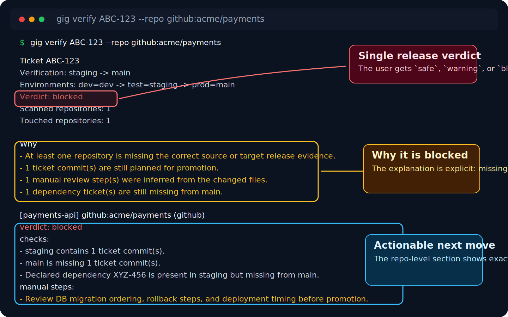
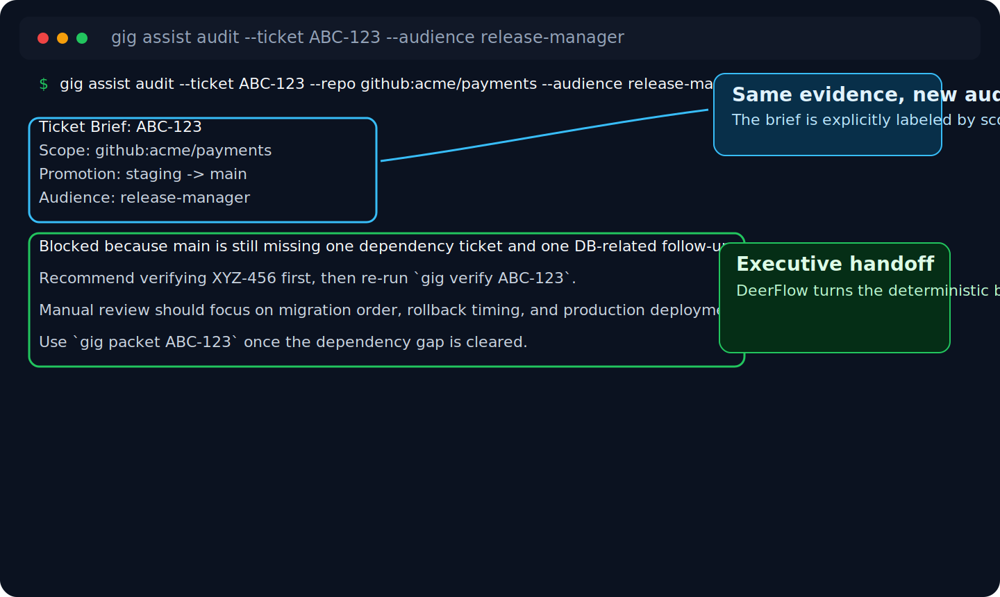

# gig

`gig` is a remote-first release audit CLI for teams that move work by ticket across many repositories.

`Did we miss any change for this ticket?`

One ticket can touch backend, frontend, database, scripts, low-code assets, and late follow-up fixes across several repos. `gig` collects that evidence directly from source control, reduces setup, and turns it into a release decision fast.

In one line:

`gig` is a deterministic ticket reconciliation and release decision tool with an optional AI briefing layer.

What that means:

- inspect one ticket across repos without cloning first
- verify whether the next promotion is `safe`, `warning`, or `blocked`
- generate release-ready Markdown, JSON, and audience-specific AI handoff briefs

## Why This Exists

Teams already have Git history.
What they usually do not have is a fast answer to:

- which repos this ticket really touched
- whether a follow-up fix made it to the target branch
- whether a DB, config, or dependency change still needs manual review
- whether the release manager, QA, and client can read the same facts in a format that fits them

That is the gap `gig` is trying to close.

## Positioning

| Option | Good at | Breaks down when | `gig` angle |
| --- | --- | --- | --- |
| `git log`, `git branch`, provider UI | raw repo inspection | one ticket spans many repos, branches, and late fixes | aggregates ticket evidence into one audit view |
| custom release scripts | team-specific automation | setup is brittle and hard to reuse across projects | zero-config-first, human-readable, JSON-friendly CLI |
| generic AI chat | summarizing text | source of truth is ambiguous or incomplete | deterministic release evidence first, AI second |
| issue tracker status | workflow tracking | issue state does not prove branch or commit state | verifies actual repo and promotion state |

## First Look

`gig` now opens with a guided terminal front door instead of dropping straight into a wall of help text.



The optional DeerFlow sidecar now has a readiness check plus a bootstrap command so AI briefings feel like part of the product, not a separate manual setup project.



If you want a deterministic terminal walkthrough for docs, social posts, or a portfolio demo, use:

```bash
./scripts/demo/frontdoor.sh
./scripts/demo/record-frontdoor.sh
```

[](docs/25-demo-guide.md)

The generated cast is checked in at `docs/assets/gig-demo.cast`.

## See The Flow

`gig inspect` shows the raw release evidence in one place: ticket scope, touched repos, risky files, dependency tickets, and provider-backed PR or deployment signals.



`gig verify` compresses that evidence into a release decision with explicit reasoning, so the user sees immediately why the move is `safe`, `warning`, or `blocked`.



`gig assist audit` keeps the deterministic bundle underneath, then asks DeerFlow to turn it into an audience-specific handoff brief instead of making people read raw audit output.



## Product Direction

`gig` should feel simple after install:

- install it and run it immediately
- sign in once to GitHub, GitLab, Bitbucket, or Azure DevOps when needed
- search ticket evidence online across remote branches by default
- auto-detect protected branches, likely release flow, and repo relationships
- remember each product or client setup as a workarea so the user can come back later and continue
- keep config as an optional upgrade, not a first-run requirement
- optionally turn structured audit evidence into an AI briefing without changing the deterministic core
- present a console experience that is calm, keyboard-friendly, readable, and easy to drill into

## The Real Pain Points

`gig` should solve these problems first:

- "I do not know which repos this ticket touched."
- "This ticket failed QA twice and picked up follow-up fixes. Did we catch all of them?"
- "I should not have to wire config before the tool becomes useful."
- "I work across many projects and repos. I want the tool to remember each setup."
- "I need terminal output that is readable for humans and structured enough for audit."

## North-Star Experience

The intended front door is:

1. install `gig`
2. run `gig`
3. sign in to a provider if needed
4. let `gig` prompt for an action, ticket, or remote repo in the terminal
5. let `gig` remember the project automatically or switch to a saved workarea later
6. get a clear audit result with evidence, risk, and next actions

That is the direction.
The current build already has useful release logic, but some advanced paths still surface local scanning and manual overrides more often than the target product should.

## What You Can Do With It Today

The current build already does these parts well:

- inspect the full ticket story across repositories
- verify whether a promotion looks `safe`, `warning`, or `blocked`
- generate Markdown and JSON release packets
- generate experimental AI ticket, release, and conflict briefings from the same evidence bundles when DeerFlow is available
- inspect GitHub, GitLab, Bitbucket, and Azure DevOps repositories directly with login-backed remote access
- inspect remote SVN repositories directly with stored or env-backed credentials
- save project defaults as workareas and switch back to them later
- scan a local workspace when remote access is not enough
- remember inferred branch topology in workareas after a successful remote run
- load team overrides when a mature team needs more control
- inspect and walk supported Git text conflicts from the terminal

Most commands are still read-only.
`gig` helps you inspect, verify, and prepare.
It now also helps with active Git conflict resolution, but it still does not cherry-pick, merge, or deploy for you automatically.
Human terminal output now favors a stronger top summary, clearer verdict emphasis, and a recommended next step so users can scan the answer quickly before drilling into repo detail.

## Who This Is For

`gig` is a good fit when your team says things like:

- "This ticket touched backend, frontend, and DB. Did we collect everything?"
- "QA passed, but is `test` still missing one late fix from `dev`?"
- "Client failed review once, then we fixed it again. Did that last commit reach `main`?"
- "This ticket has DB or config changes. What needs manual review before release?"

## The Commands People Usually Start With

If you want the best current workflow today, start with a remote repository first:

```bash
gig
gig login github
gig inspect ABC-123 --repo github:owner/name
gig verify --ticket ABC-123 --repo github:owner/name
gig assist doctor
gig assist setup
gig manifest generate --ticket ABC-123 --repo github:owner/name
gig assist audit --ticket ABC-123 --repo github:owner/name --audience release-manager
```

Supported remote repository targets today:

- `github:owner/name`
- `gitlab:group/project`
- `bitbucket:workspace/repo`
- `azure-devops:org/project/repo`
- `svn:https://svn.example.com/repos/app/branches/staging/ProductName`

Help screens now lead with start-here examples, common flags, and next commands instead of a flat usage dump:

```bash
gig --help
gig inspect --help
gig verify --help
gig plan --help
gig manifest --help
```

If your team needs local fallback or explicit overrides, add:

```bash
gig scan --path .
gig doctor --path .
gig resolve status --path .
gig assist resolve --path . --ticket ABC-123 --audience release-manager
```

Most teams should start without any repo config file.
Only add `gig.yaml` when inference is wrong or when you want richer repo metadata such as service, owner, kind, and notes.
If you are working directly against GitHub, GitLab, Bitbucket, or Azure DevOps, `gig` can authenticate through the provider login flow and read repository state live without cloning first.
On macOS, Bitbucket API tokens are stored in Keychain by default. In CI or other non-interactive environments, use `GIG_BITBUCKET_EMAIL` and `GIG_BITBUCKET_API_TOKEN`.
For remote SVN, use `gig login svn` once or set `GIG_SVN_USERNAME` and `GIG_SVN_PASSWORD` for non-interactive runs.

## A Friendly First Workflow

### 1. Connect to a provider once

```bash
gig
gig login github
gig login gitlab
gig login bitbucket
gig login azure-devops
gig login svn
```

### 2. Inspect a remote repository directly

```bash
gig inspect ABC-123 --repo github:owner/name
gig verify --ticket ABC-123 --repo github:owner/name
```

Use this when you want the shortest path after login.
After a successful remote run, `gig` remembers that repository as your current project automatically.

### 3. Optionally save or pick a workarea once

```bash
gig workarea add --provider github --use
gig workarea add payments --repo github:owner/name --from staging --to main --use
gig workarea add billing --repo gitlab:group/project --from develop --to release/test --envs dev=develop,test=release/test,prod=main
gig workarea use billing
gig workarea list
```

Use this when you want `gig` to remember one project so later commands do not need a repeated repo target or branch mapping.
If you omit `--repo` and `--path`, `gig` can now discover a repository from your logged-in GitHub, GitLab, Bitbucket, or Azure DevOps account and let you choose it interactively.
The picker accepts either a number or filter text, and recent workareas or repositories are promoted to the top so repeated project switching stays short.

### 4. Inspect one ticket directly on a remote repository or the current workarea

```bash
gig inspect ABC-123
gig inspect ABC-123 --repo github:owner/name
gig inspect ABC-123 --repo gitlab:group/project
gig inspect ABC-123 --repo bitbucket:workspace/repo
gig inspect ABC-123 --repo azure-devops:org/project/repo
gig inspect ABC-123 --repo svn:https://svn.example.com/repos/app/branches/staging/ProductName
```

### 5. Check whether the next move looks safe

```bash
gig verify --ticket ABC-123
gig verify --ticket ABC-123 --repo github:owner/name
```

`gig` will try to infer the protected-branch release path automatically for supported remote repositories.
On GitHub, GitLab, Bitbucket, and Azure DevOps, inspect, verify, plan, and manifest outputs now also surface pull request and deployment evidence when the provider can confirm it.

### 6. Generate a release packet people can actually read

```bash
gig manifest generate --ticket ABC-123
gig manifest generate --ticket ABC-123 --repo github:owner/name
```

### 6.1. Optionally ask DeerFlow for an audience-specific ticket briefing

If you have not bootstrapped the local DeerFlow sidecar yet, start with:

```bash
gig assist doctor
gig assist setup
```

```bash
gig assist audit --ticket ABC-123 --repo github:owner/name --audience qa
gig assist audit --ticket ABC-123 --repo github:owner/name --audience client
gig assist audit --ticket ABC-123 --repo github:owner/name --audience release-manager
```

These experimental commands keep `gig` as the deterministic evidence engine and ask DeerFlow to turn that bundle into a concise brief for the audience that will consume it.

### 5.2. Optionally ask DeerFlow for a release-level briefing

```bash
gig assist release --release rel-2026-04-09 --path . --audience release-manager
gig assist release --release rel-2026-04-09 --ticket-file tickets.txt --repo github:owner/name --audience release-manager
```

Use the first form when you already saved ticket snapshots into the release.
Use the second form when you want `gig` to assemble the release bundle live from remote or local ticket evidence without depending on `.gig/releases/...`.

### 5.3. Optionally ask DeerFlow for a conflict-resolution brief

```bash
gig assist resolve --path . --ticket ABC-123 --audience qa
gig assist resolve --path . --ticket ABC-123 --audience release-manager
```

Use this when Git has already stopped on a conflict and you want `gig` to explain the active block, scope warnings, and likely next action before you choose a resolver key.
This does not replace `gig resolve start`.

### 6. If needed, fall back to a local workspace

### 5.1 See what repos are under the workspace

```bash
gig scan --path .
```

### 5.2 Inspect one ticket across repos

```bash
gig inspect ABC-123 --path .
```

### 5.3 Check whether the next move looks safe

```bash
gig verify --ticket ABC-123 --from test --to main --path .
```

### 5.4 Generate a release packet people can actually read

```bash
gig manifest generate --ticket ABC-123 --from test --to main --path .
```

### 5.5 Check whether your config and repo mapping are healthy

```bash
gig doctor --path .
```

### 5.6 If Git stops on conflicts, inspect or resolve them

```bash
gig resolve status --path .
gig assist resolve --path . --ticket ABC-123 --audience release-manager
gig resolve start --path .
```

## Optional Team Overrides

Most teams should not start here.

If `gig` cannot infer the right branch topology, or if you want richer team metadata in output, add a config file like this:

```yaml
ticketPattern: '\b[A-Z][A-Z0-9]+-\d+\b'

environments:
  - name: dev
    branch: develop
  - name: test
    branch: release/test
  - name: prod
    branch: main

repositories:
  - path: services/accounts-api
    service: Accounts API
    owner: Backend Team
    kind: app
    notes:
      - Verify login and billing summary in QA.
```

Supported file names:

- `gig.yaml`
- `gig.yml`
- `.gig.yaml`
- `.gig.yml`

If you do add one, `gig` will auto-detect the file from the path you run against, or you can pass `--config`.

There is also a ready sample here:

- [gig.example.yaml](https://github.com/phamhungptithcm/gig/blob/main/gig.example.yaml)

## Docs

- GitHub Pages: [phamhungptithcm.github.io/gig](https://phamhungptithcm.github.io/gig/)
- Quick start: [docs/19-quickstart.md](docs/19-quickstart.md)
- Product strategy: [docs/17-product-strategy.md](docs/17-product-strategy.md)
- CLI guide: [docs/03-cli-spec.md](docs/03-cli-spec.md)
- AI assist slice: [docs/23-ai-assist-slice.md](docs/23-ai-assist-slice.md)
- Agent skills: [SKILLS.md](SKILLS.md)
- Config spec: [docs/09-config-spec.md](docs/09-config-spec.md)
- Roadmap: [docs/13-roadmap.md](docs/13-roadmap.md)

## Install

The public npm package is `@phamhungptithcm/gig`, but the command you run after install stays `gig`.

### Quick Install With npm

```bash
npm install -g @phamhungptithcm/gig
gig version
```

Upgrade an npm install:

```bash
npm install -g @phamhungptithcm/gig@latest
gig update
gig update v2026.04.09
```

If you want to pin a specific npm package version directly, use the npm semver form:

```bash
npm install -g @phamhungptithcm/gig@2026.4.9
```

### Quick Install On macOS And Linux Without npm

Install the latest release:

```bash
curl -fsSL https://raw.githubusercontent.com/phamhungptithcm/gig/main/scripts/install.sh | sh
```

Install a specific version:

```bash
curl -fsSL https://raw.githubusercontent.com/phamhungptithcm/gig/main/scripts/install.sh | sh -s -- --version v2026.04.09
```

Update a direct install:

```bash
gig update
gig update v2026.04.09
```

### Quick Install On Windows PowerShell Without npm

Install the latest release:

```powershell
irm https://raw.githubusercontent.com/phamhungptithcm/gig/main/scripts/install.ps1 | iex
```

Install a specific version:

```powershell
& ([ScriptBlock]::Create((irm https://raw.githubusercontent.com/phamhungptithcm/gig/main/scripts/install.ps1))) -Version v2026.04.09
```

Update a direct install:

```powershell
gig update
gig update v2026.04.09
```

### Manual Download

1. Open [GitHub Releases](https://github.com/phamhungptithcm/gig/releases/latest)
2. Download the file for your operating system
3. Extract it
4. Put `gig` or `gig.exe` somewhere on your `PATH`

### Build From Source

Requirements:

- Go `1.23+`
- Git installed and available on your `PATH`

Build:

```bash
git clone https://github.com/phamhungptithcm/gig.git
cd gig
mkdir -p bin
go build -o bin/gig ./cmd/gig
```

Run:

```bash
./bin/gig version
./bin/gig --help
```

## What `gig` Does Not Do Yet

Right now, `gig` does not:

- move code automatically
- read Jira, PR, or deployment evidence yet
- build multi-ticket release bundles yet

Those are still on the roadmap.
The current focus is to make ticket-based release checking useful, reliable, and easy to adopt first.
